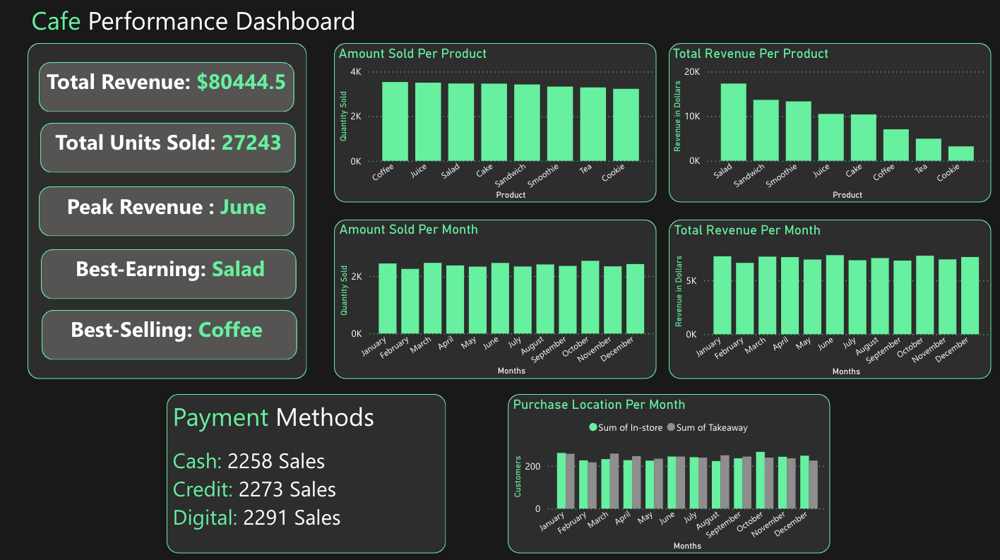

# Cafe-Analysis
## Objective
This project aimed to enhance data analysis skills by cleaning and exploring a dirty café sales dataset from Kaggle. The aim was to seekey sales trends and performance insights using Python’s Pandas and Matplotlib libraries for preprocessing and visualization and Power BI for dashboard creation.
## Dashboard

# Key Findings
## Overall Performance
- The café generated $80,444.50 in total revenue across 27,243 units sold.
- June recorded the highest revenue of the year.
## Best Products
- Coffee was the best-selling item by quantity.
- Salad brought in the highest revenue overall.
## Monthly Trends
- The monthly sales volume remained steady, with peak sales in June.
-Revenue across months was consistently above $6,000, with the highest in June and the lowest in February.
## Payment Method Preferences
- Customers used Digital Wallets (2,291) slightly more than Credit Cards (2,273) and Cash (2,258), indicating a balanced but modern payment trend.
## Purchase Location Insights
- In-store and takeaway orders were nearly equal each month, reflecting a balanced business model that caters to both dine-in and on-the-go customers.

